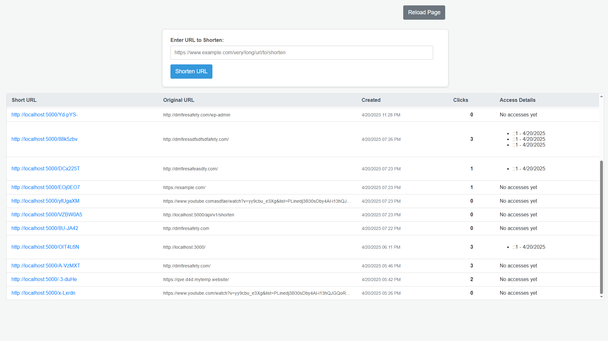

# URL Shortener API

## 1. Overview

This project is a RESTful API built with Node.js, Express, and MongoDB that provides URL shortening services. It allows users to create short, unique codes for long URLs, retrieve the original URL using the short code, update the associated long URL, delete the short URL entry, and view basic access statistics for each short URL.

It also includes a basic web interface (using EJS) to display the history of shortened URLs and handle the redirection from the short URL to the original URL.

### Screenshots

#### Home Page (Form Input and History)


#### Error Page


## 2. Features


*   **Create Short URL:** Generate a unique short code for a given long URL via API.
*   **Retrieve Original URL Data:** Get the details (excluding statistics) associated with a short code via API.
*   **Redirect:** Accessing the short URL path (e.g., `http://yourdomain.com/{shortCode}`) redirects the user to the original long URL and increments the access count.
*   **Update Short URL:** Modify the original long URL associated with an existing short code via API.
*   **Delete Short URL:** Remove a short URL entry from the system via API.
*   **Get Statistics:** Retrieve details including the access count for a short URL via API.
*   **Homepage:** Displays a form to shorten URLs and a history of previously shortened URLs.

## 3. Tech Stack

*   **Backend:** Node.js
*   **Framework:** Express.js
*   **Database:** MongoDB (using Mongoose ODM)
*   **Templating (Optional Frontend):** EJS
*   **Short Code Generation:** nanoid
*   **Package Manager:** npm

## 4. Prerequisites

Before you begin, ensure you have the following installed on your system:

*   [Node.js](https://nodejs.org/) (which includes npm) (LTS version recommended)
*   [MongoDB](https://www.mongodb.com/try/download/community) installed and running locally, OR access to a MongoDB Atlas cluster (or similar cloud service).
*   [Git](https://git-scm.com/) (for cloning the repository)
*   A code editor (like VS Code)
*   An API testing tool (like Postman or Insomnia)

## 5. Setup and Installation

Follow these steps to get the server running locally:

1.  **Clone the repository:**
    ```bash
    git clone https://github.com/adeelfeb/muhammad-innovaxel-adeel-tariq
    cd https://github.com/adeelfeb/muhammad-innovaxel-adeel-tariq
    ```

2.  **Switch to the development branch:**
    ```bash
    git checkout dev
    ```

3.  **Install dependencies:**
    ```bash
    cd server
    npm install
    ```

4.  **Configure Environment Variables:**
    *   Create a file named `.env` in the root of your project directory.
    *   Add the following variables, replacing placeholders:

    ```dotenv
    # .env

    # Server Configuration
    PORT=5000 # Or your preferred port

    # MongoDB Configuration
    MONGO_URI=mongodb://127.0.0.1:27017/urlshortener # Example: Local DB connection string
    # MONGO_URI=mongodb+srv://<user>:<password>@<cluster-url>/urlshortener?retryWrites=true&w=majority # Example: Atlas

    # Base URL for constructing short links (IMPORTANT: No trailing slash)
    BASE_URL=http://localhost:5000 # Use the same port as PORT above for local development
    ```

5.  **Ensure MongoDB is Running:**
    *   Start your local MongoDB server or ensure your Atlas cluster is accessible.

## 6. Running the Server

1.  **Start the application:**
    ```bash
    npm start
    ```
    *   Or for development with auto-reload (since nodemon is configured):
        ```bash
        npm run dev
        ```

2.  **Check the console output:** Look for messages confirming the server is running and the database is connected.

3.  **Access:**
    *   **Homepage:** Open your web browser to `http://localhost:PORT` (e.g., `http://localhost:5000`).
    *   **API:** Use an API client to interact with the endpoints listed below, prefixed with `/api/v1`.

## 7. Web Interface & Redirects (Root Routes)

These routes handle the user-facing parts and the core redirection logic. They are mounted under `/`.

*   **`GET /`**
    *   **Controller:** `renderHomePage`
    *   **Description:** Renders the main HTML page (`index.ejs`) displaying the URL submission form and a table listing previously shortened URLs with their details (original URL, short URL, creation date, click count).
*   **`GET /:shortCode`**
    *   **Controller:** `redirectToOriginalUrl`
    *   **Description:** This is the core redirect handler. When a user accesses a short URL (e.g., `http://localhost:5000/xyz123`), this route captures the `shortCode`.
    *   It looks up the `shortCode` in the database.
    *   If found, it increments the `accessCount` for that URL.
    *   It then performs an HTTP 302 redirect to the `originalUrl` stored in the database.
    *   If the `shortCode` is not found, it renders a 404 error page.

## 8. API Endpoints (Mounted under `/api/v1`)

These endpoints provide a RESTful interface for managing shortened URLs.

### 8.1 Create Short URL

*   **Endpoint:** `POST /api/v1/shorten`
*   **Controller:** `createShortUrl`
*   **Description:** Creates a new short URL or returns the existing one if the original URL has already been shortened.
*   **Request Body:**
    ```json
    {
        "url": "https://www.example.com/some/very/long/url/to/shorten"
    }
    ```
*   **Success Response (201 Created or 200 OK):**
    ```json
    {
        "statusCode": 201, // or 200 if existing
        "data": {
            "id": "60c72b3f...", // MongoDB ObjectId
            "url": "https://www.example.com/some/very/long/url/to/shorten",
            "shortCode": "abc123",
            "shortUrl": "http://localhost:5000/abc123", // Constructed using BASE_URL
            "createdAt": "2023-10-27T10:00:00.000Z",
            "updatedAt": "2023-10-27T10:00:00.000Z"
        },
        "message": "Short URL created successfully", // or "Short URL already exists"
        "success": true
    }
    ```
*   **Error Responses:**
    *   `400 Bad Request`: If `url` is missing, empty, or invalid format.
    *   `500 Internal Server Error`: If database error or unique code generation fails.

### 8.2 Retrieve Original URL Data

*   **Endpoint:** `GET /api/v1/shorten/:shortCode`
*   **Controller:** `getOriginalUrlData`
*   **Description:** Retrieves the details (excluding access count) for a specific short URL.
*   **URL Parameters:**
    *   `shortCode`: The unique short code of the URL (e.g., `abc123`).
*   **Success Response (200 OK):**
    ```json
    {
        "statusCode": 200,
        "data": {
             "id": "60c72b3f...",
             "url": "https://www.example.com/some/very/long/url/to/shorten",
             "shortCode": "abc123",
             "createdAt": "2023-10-27T10:00:00.000Z",
             "updatedAt": "2023-10-27T10:00:00.000Z"
        },
        "message": "URL data retrieved successfully",
        "success": true
    }
    ```
*   **Error Responses:**
    *   `404 Not Found`: If the `shortCode` does not exist.
    *   `400 Bad Request`: If `shortCode` parameter is missing (less likely with proper routing).

### 8.3 Update Short URL

*   **Endpoint:** `PUT /api/v1/shorten/:shortCode`
*   **Controller:** `updateShortUrl`
*   **Description:** Updates the original long URL associated with an existing short code.
*   **URL Parameters:**
    *   `shortCode`: The unique short code of the URL to update.
*   **Request Body:**
    ```json
    {
        "url": "https://www.example.com/some/new/updated/url"
    }
    ```
*   **Success Response (200 OK):**
    ```json
    {
        "statusCode": 200,
        "data": {
             "id": "60c72b3f...",
             "url": "https://www.example.com/some/new/updated/url", // The new URL
             "shortCode": "abc123",
             "createdAt": "2023-10-27T10:00:00.000Z", // Original creation date
             "updatedAt": "2023-10-27T11:30:00.000Z"  // Updated timestamp
        },
        "message": "Short URL updated successfully",
        "success": true
    }
    ```
*   **Error Responses:**
    *   `404 Not Found`: If the `shortCode` does not exist.
    *   `400 Bad Request`: If `url` is missing in the body, empty, invalid format, or `shortCode` parameter is missing.

### 8.4 Delete Short URL

*   **Endpoint:** `DELETE /api/v1/shorten/:shortCode`
*   **Controller:** `deleteShortUrl`
*   **Description:** Deletes a short URL entry.
*   **URL Parameters:**
    *   `shortCode`: The unique short code of the URL to delete.
*   **Success Response (200 OK with message or 204 No Content):**
    *   *(Using ApiResponse as shown in controller):*
        ```json
        {
            "statusCode": 204,
            "data": null,
            "message": "Short URL deleted successfully",
            "success": true
        }
        ```
    *   *(Standard REST 204):* No response body.
*   **Error Responses:**
    *   `404 Not Found`: If the `shortCode` does not exist.
    *   `400 Bad Request`: If `shortCode` parameter is missing.

### 8.5 Get URL Statistics

*   **Endpoint:** `GET /api/v1/shorten/:shortCode/stats`
*   **Controller:** `getShortUrlStats`
*   **Description:** Retrieves full details for a short URL, including the access count.
*   **URL Parameters:**
    *   `shortCode`: The unique short code of the URL.
*   **Success Response (200 OK):**
    ```json
    {
        "statusCode": 200,
        "data": {
             "id": "60c72b3f...",
             "url": "https://www.example.com/some/very/long/url/to/shorten",
             "shortCode": "abc123",
             "createdAt": "2023-10-27T10:00:00.000Z",
             "updatedAt": "2023-10-27T11:30:00.000Z", // Example if updated
             "accessCount": 15 // The number of times redirected
        },
        "message": "URL statistics retrieved successfully",
        "success": true
    }
    ```
*   **Error Responses:**
    *   `404 Not Found`: If the `shortCode` does not exist.
    *   `400 Bad Request`: If `shortCode` parameter is missing.

## 9. Error Handling

The API uses a consistent error response format (likely defined by `ApiError` and handled by middleware). Errors will typically return a JSON response with `statusCode`, `message`, `errors` (optional details), and `success: false`.
